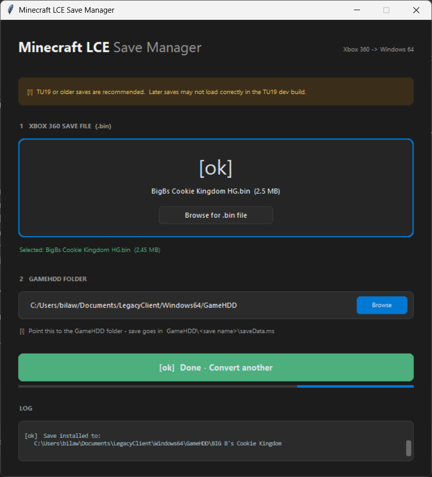

# LCE Save Converter - Xbox 360 to Windows 64

Converts Xbox 360 Minecraft Legacy Console Edition save files (.bin STFS CON containers) to the Windows 64 LCE format. This is the first tool to do a full 1:1 conversion between these two platforms.

All world data is preserved - terrain, chests, items, signs, maps, player inventories, Nether/End dimensions.



[Watch the demo video](media/demo.mp4)

## How it works

The tool handles the entire pipeline:

1. Parses the Xbox 360 STFS container and extracts `savegame.dat`, following the block chain for fragmented files
2. Decompresses the XMemCompress (LZX) stream using the native LDI library
3. Decompresses each region chunk's mini-LZX stream using CHMLib, then recompresses with zlib for Win64
4. Rebuilds the save in little-endian Win64 format with correct offsets
5. Outputs `saveData.ms` ready to drop into the game's save folder

## Requirements

- Python 3.10+
- `customtkinter` and `Pillow` (for the GUI)
- `tkinterdnd2` (optional, for drag-and-drop)

Install dependencies:
```
pip install customtkinter Pillow tkinterdnd2
```

The two included DLLs (`LZXDecompression.dll` and `chm_lzx.dll`) must be in the same folder as `save_manager.py`.

## Usage

GUI mode:
```
python save_manager.py
```

With a file preloaded:
```
python save_manager.py "path/to/save.bin"
```

Set the output folder to your game's `GameHDD` directory. The converted save will be placed in a subfolder with `saveData.ms`, `worldname.txt`, and `thumbnail.png`.

## Output format

The tool outputs saves in the standard Win64 LCE format:

```
GameHDD/
  <save folder>/
    saveData.ms       - the converted save (this is the only file the game reads)
    worldname.txt     - world name displayed on the load screen (optional, for your reference)
    thumbnail.png     - save thumbnail (optional, for your reference)
```

Only `saveData.ms` is required. The `.txt` and `.png` are there so you can identify which save is which - the game itself only looks at the `.ms` file.

## Tested

Tested against 42 different Xbox 360 saves with a 100% conversion success rate. Saves range from small single-player worlds to large hunger games maps with hundreds of map items and dozens of player files.

## Technical details

The Xbox 360 save format differs from Win64 in several ways:

- **Container**: Xbox 360 uses STFS (CON) packages. The tool handles block chain traversal, hash table lookups across primary/backup tables, and group boundary crossings.
- **Compression**: The save-level data uses XMemCompress (LZX) with 32KB chunks. Region file chunks use individual mini-LZX streams. Win64 uses zlib for both.
- **Endianness**: Xbox 360 stores the `ConsoleSaveFileOriginal` header and file table in big-endian. Win64 uses little-endian. NBT data within chunks is always big-endian on all LCE platforms.
- **Region chunks**: Each chunk is stored as `[compLength | RLE_flag][decompLength][compressed data]`. The compression layer is RLE + platform compression (LZX on 360, zlib on Win64).

## Credits

- **GoobyCorp** - [LZXDecompression.dll](https://github.com/GoobyCorp/Xbox-360-Crypto) (LDI library for save-level LZX decompression)
- **Jed Wing / CHMLib** - [lzx.c](https://github.com/jedwing/CHMLib) LZX decoder for region chunk decompression, originally from cabextract
- **4J Studios** - Original Minecraft LCE developers
- **bnnm** - [XNB LZX decompressor gist](https://gist.github.com/bnnm/1d771a406cc2900320fe8df2aa981d12) that documented the chunk framing format
- **arkem/py360** - [py360](https://github.com/arkem/py360) STFS parsing reference
- **kbinani/je2be-core** - [je2be](https://github.com/kbinani/je2be-core) LCE conversion reference

## License

MIT License - see [LICENSE](LICENSE) for details.

The included DLLs have their own licenses:
- `LZXDecompression.dll` - see [GoobyCorp/Xbox-360-Crypto](https://github.com/GoobyCorp/Xbox-360-Crypto)
- `chm_lzx.dll` - based on CHMLib/cabextract (GPL v2 with CHMLib exemption)
