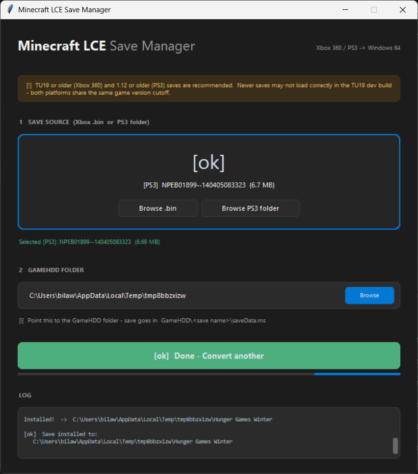

# LCE Save Converter - Xbox 360 / PS3 to Windows 64

Converts Minecraft Legacy Console Edition save files to the Windows 64 LCE format. Takes Xbox 360 `.bin` STFS CON containers and PS3 save folders (`GAMEDATA`) and turns them into a `saveData.ms` the PC client can load.

All world data is preserved - terrain, chests, items, signs, maps, player inventories, Nether/End dimensions.

## Supported save versions

- **Xbox 360**: TU19 and older
- **PS3**: 1.12 and older (1.12 PS3 is the same game version as TU19 on 360)

Anything newer than that bumps the save past the version this converter and the target Win64 dev build can read, so 1.13+ PS3 saves and TU20+ Xbox saves won't work.

| Xbox 360 | PS3 |
| :---: | :---: |
|  |  |

[Watch the demo video](media/demo.mp4)

## How it works

Xbox 360 pipeline (`converter.py`):

1. Parses the Xbox 360 STFS container and extracts `savegame.dat`, following the block chain for fragmented files
2. Decompresses the XMemCompress (LZX) stream using the native LDI library
3. Decompresses each region chunk's mini-LZX stream using CHMLib, then recompresses with zlib for Win64
4. Rebuilds the save in little-endian Win64 format with correct offsets
5. Outputs `saveData.ms` ready to drop into the game's save folder

PS3 pipeline (`converter_ps3.py`):

1. Reads the world name from `PARAM.SFO` (`SUB_TITLE`)
2. Reads `GAMEDATA` directly - on PS3 the 4J save sits unwrapped in big-endian, no STFS, no XMemCompress
3. Rewrites each region chunk from raw deflate to zlib (PS3 uses `[4B BE uncomp size][raw deflate]` per chunk, not LZX)
4. Converts the file table and header from BE to LE
5. Copies `THUMB` across as `thumbnails/thumbData.png`

## Requirements

- Python 3.10+
- `customtkinter` and `Pillow` (for the GUI)
- `tkinterdnd2` (optional, for drag-and-drop)

Install dependencies:
```
pip install customtkinter Pillow tkinterdnd2
```

The two included DLLs (`LZXDecompression.dll` and `chm_lzx.dll`) must be in the same folder as `save_manager.py`.

## Usage

GUI mode:
```
python save_manager.py
```

With a file or folder preloaded:
```
python save_manager.py "path/to/save.bin"
python save_manager.py "path/to/NPEB01899--<id>"
```

Set the output folder to your game's `GameHDD` directory. The converted save will be placed in a subfolder with `saveData.ms` and `thumbnails/thumbData.png`.

## Output format

The tool outputs saves in the standard Win64 LCE format:

```
GameHDD/
  <save folder>/
    saveData.ms                    - the converted save data
    thumbnails/
      thumbData.png                - save thumbnail shown in the world list and detail view
```

The thumbnail lives in a `thumbnails` subfolder as `thumbData.png` to match where the game's storage library looks for it after the 4JLibs upgrade. The world name is stored inside `saveData.ms` itself, so no sidecar text file is needed.

## Tested

Tested against 42 different Xbox 360 saves with a 100% conversion success rate. Saves range from small single-player worlds to large hunger games maps with hundreds of map items and dozens of player files. PS3 support has been confirmed on both EU (NPEB) and US (NPUB) digital saves, and the format is identical across every PS3 title ID so the rest should behave the same. If you hit a save it chokes on, open an issue.

## Technical details

The Xbox 360 save format differs from Win64 in several ways:

- **Container**: Xbox 360 uses STFS (CON) packages. The tool handles block chain traversal, hash table lookups across primary/backup tables, and group boundary crossings. PS3 drops the container entirely and stores the 4J save directly in `GAMEDATA`.
- **Compression**: The save-level data uses XMemCompress (LZX) with 32KB chunks on Xbox 360. PS3 leaves the save-level uncompressed. Region file chunks use mini-LZX streams on 360 and raw deflate (with a 4-byte BE uncompressed-size header) on PS3. Win64 uses zlib everywhere.
- **Endianness**: Xbox 360 and PS3 both store the `ConsoleSaveFileOriginal` header and file table in big-endian. Win64 uses little-endian. NBT data within chunks is always big-endian on all LCE platforms.
- **Region chunks**: Each chunk is stored as `[compLength | RLE_flag][decompLength][compressed data]`. The compression layer is RLE + platform compression (LZX on 360, raw deflate on PS3, zlib on Win64).

## Credits

- **GoobyCorp** - [LZXDecompression.dll](https://github.com/GoobyCorp/Xbox-360-Crypto) (LDI library for save-level LZX decompression)
- **Jed Wing / CHMLib** - [lzx.c](https://github.com/jedwing/CHMLib) LZX decoder for region chunk decompression, originally from cabextract
- **4J Studios** - Original Minecraft LCE developers
- **bnnm** - [XNB LZX decompressor gist](https://gist.github.com/bnnm/1d771a406cc2900320fe8df2aa981d12) that documented the chunk framing format
- **arkem/py360** - [py360](https://github.com/arkem/py360) STFS parsing reference
- **kbinani/je2be-core** - [je2be](https://github.com/kbinani/je2be-core) LCE conversion reference

## License

GNU GPLv3 License - see [LICENSE](LICENSE) for details.

The included DLLs have their own licenses:
- `LZXDecompression.dll` - see [GoobyCorp/Xbox-360-Crypto](https://github.com/GoobyCorp/Xbox-360-Crypto)
- `chm_lzx.dll` - based on CHMLib/cabextract (GPL v2 with CHMLib exemption)
